# Rock Paper Scissors Lizard Spock Game
## An easy going game for people looking to kill some time as well as Big Bang Theory fans!
### Aurelijus Jarasius

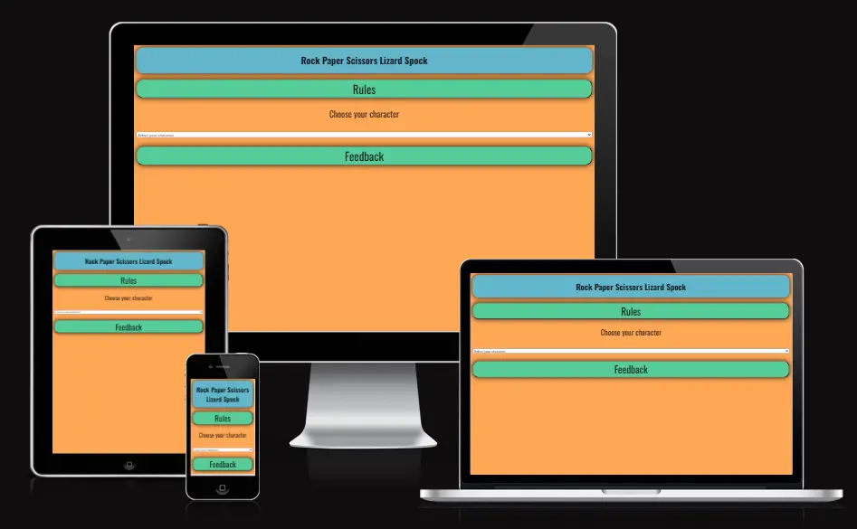

## [Live site](https://aurelijusjarasius.github.io/rpsls-game/)

## [Repository](https://github.com/AurelijusJarasius/rpsls-game)

## Table of Contents

 1. [ UX ](#ux)
 2. [ Features ](#features)  
 3. [ Future Features ](#future)  
 4. [ Technology used ](#tech) 
 5. [ Testing ](#testing)  
 6. [ Bugs ](#bugs)  
 7. [ Deployment](#deployment)
 8. [ Credits](#credits)
 9. [ Content](#content)  
 10. [ Acknowledgements](#acknowledgements) 

 ## UX

### Pre-project planning
When deciding on the project, I evaluated the examples given through course content. Quizes are not something that I do quite often and there are a lot of trends website out there. I settled on rock paper scissors lizard spock game as it stood out to me as it is something different, and upon more researched there are not many games out there.
I then decided to do rock paper scissors lizard spock game with a big bang theory twist on it as I'm a huge fan of the show.

## UX Design

### To identify the best way forward for my project, I started looking at the user and business requirements for this type of game

## User stories

> As a new player I want to play a simple game and relax

> As a player I want to understand the rules of the game

> As a player I want to be able to pick my character

> As a player I want to be able to keep score

> As a player I want to be able to leave feedback if I like it or have an idea for improvement

## Owner

> As an owner I need to provide an easy going game

> As an owner I need to provide rules of the game

> As an owner I need to provide character selection options

> As an owner I need to provide a score area

> As an owner I need to provide a feedback form

## Scope Pane

> Website should have consistent navigation layout

> Website should have a header clearly indicating the game

> Website should contain rules section

> Website should contain character selection dropdown

> Website should contain game area

> Website should contain hand choice for the player

> Website should contain score tracker

> Website should contain feedback form

## Structure Pane

> Website will contain 2 pages: Main page for the game and feedback form page

### Home Page

> Header with the name of the game

> Rules button to open a modal

> Character selection box

> Hand choice buttons

> Score trackers for player and computer

> Feedback button to open a form

### Feedback Page

> Header thanking user for playing

> Feedback form with data validation

> Submit button to submit feedback

> Home button to return back to the game

### Sekeleton Pane

> Starting development game layout frame

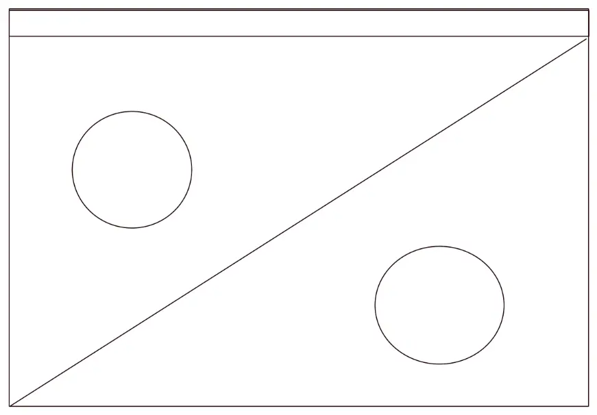

> Mid point development game layout frame

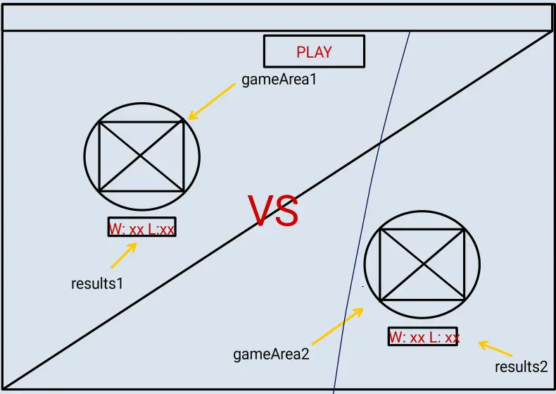

> Final development game layout frame

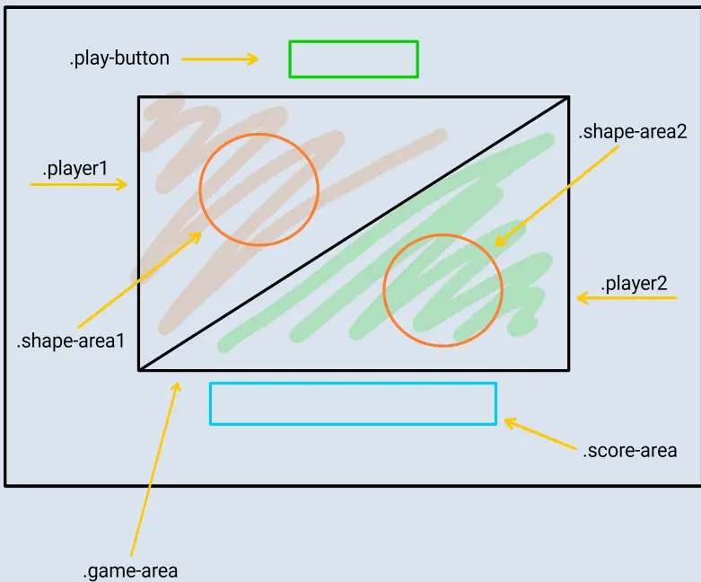

> While the planned layout of the page looked good on larger screens, I realised that it is not mobile friendly. I then shifted to basic vertical view for mobile and horizontal layout for larger screens

### Colours

> I decided to use pastel colors so that they're not too bright as this should be a game to relax

> I chose a warm color for the background with cold colors for the buttons and game area

#### Fonts

- Oswald
- Sans-serif

#### Colours

- #ffa756
- #62b6cb
- #38a3a5
- #57cc99
- #fefefe

# Features

### index.html

#### Header
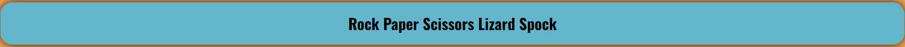
> Header contains the name of the game

#### Rules button
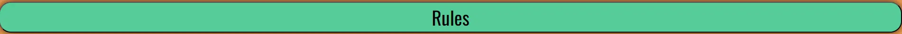
> Rules button contains a modal

#### Rules modal

> Modal contains a video explaining the rules of the game as well as text containing all outcomes

#### Character selection dropdown
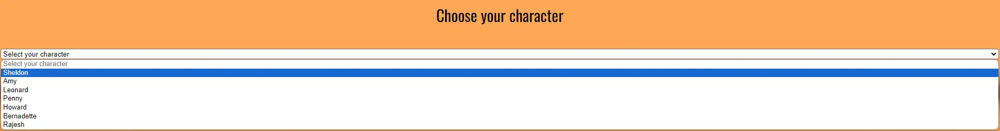
> Character selection dropdown contains main Big Bang Theory character choices

#### Game area
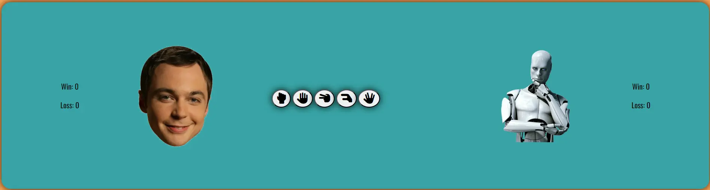
> Once character is chosen the game area opens with hand choice buttons

#### Win/Loss/Tie indicators
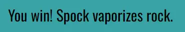
> Comment indicating win and explaining why

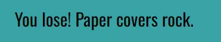
> Comment indicating loss and explaining why

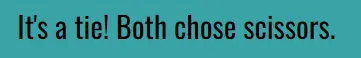
> Comment indicating tie and explaining why

#### Score counter
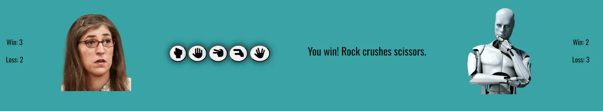
> Score counters for player and computer showing wins and losses

#### Feedback button
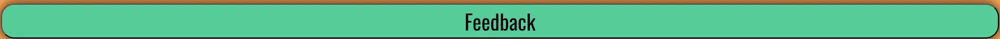
> Feedback button directing users to a feedback form page

### feedback.html

#### Header

> Message to thank users for playing

#### Form
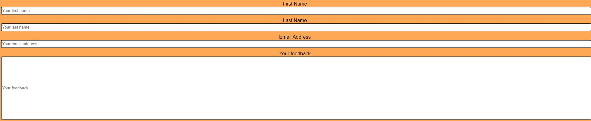
> Feedback form requiring first name, last name, email address and feedback(free text)

#### Submit button

> Button to submit feedback

#### Home button
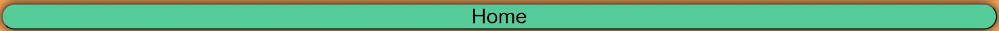
> Button to bring user back to the game

### Feature Development

#### commit 6d79673
> When developing and testing javascript code for the game, found it difficult to nail down the rules and functions for the game. Upon research into similar games and reviewing forums I decided to get help via chat.gpt. I got a basic breakdown and assistance for the rules and functions and amended those to work with my game

#### commit ad9e6cf
> Had an alert pop up prompting player to choose character before beginning the game. Changed the approach to hide the game area if character is not chosen after meeting with my mentor

# Future Features

> Add quotes to the characters when winning or losing

> Add quotes for the computer mocking player when winning and complaining when losing

> Add streak counters and pop ups eg. Fireworks display when 10 wins in a row

# Testing

> Majority of the testing has been conducted by myself and relatives to ensure sit is useable, responsive and easy to navigate

### Testing Phase
#### Testing for links and form
| Test | Expectation | Result |
|--|--|--|
Feedback Button | Links to feedback form on feedback.html | Pass |
First Name | Mandatory field - requests user to input | Pass |
Last Name | Mandatory field - requests user to input | Pass |
Email Address | Mandatory field - requests user to input email address | Pass |
Comment | Mandatory field - requests user to input | Pass |
Submit Button | Submits form when filled in | Pass |
Home Button | Brings back the user to the game | Pass |

#### Testing buttons and character functionality
| Test | Expectation | Result |
|--|--|--|
Rules Button | Opens up modal displaying video & game outcomes | Pass |
Modal Video | Video can be played | Pass |
Hidden game area | Game area hidden and displays when character chosen | Pass |
Character selection dropdown | Displays characters options for the game | Pass |
Sheldon character selection | Displays Sheldon in game area when chosen | Pass |
Amy character selection | Displays Amy in game area when chosen | Pass |
Leonard character selection | Displays Leonard in game area when chosen | Pass |
Penny character selection | Displays Penny in game area when chosen | Pass |
Howard character selection | Displays Howard in game area when chosen | Pass |
Bernadette character selection | Displays Bernadette in game area when chosen | Pass |

#### Testing choices buttons & comments
| Test | Expectation | Result |
|--|--|--|
Rock Button | Submits user choice | Pass |
Paper Button | Submits user choice | Pass |
Scissors Button | Submits user choice | Pass |
Lizard Button | Submits user choice | Pass |
Spock Button | Submits user choice | Pass |
Win comment & explanation | Displays win and reason | Pass |
Loss comment & explanation | Displays loss and reason | Pass |
Tie comment & explanation | Displays tie and reason | Pass |

#### Testing for responsiveness
| Test | Result |
|--|--|
Game & Feedback form displays correctly on screens less than 769px | Pass |
Game & Feedback form displays correctly on screens larger than 992px | Pass |

#### Browser Testing
| Browser | Test | Expectation | Result |
|--|--|--|--|
Chrome | Browse through both pages and play game 10 times sucessfully | Content displayed correctly and game working as expected | Pass |
Edge | Browse through both pages and play game 10 times sucessfully | Content displayed correctly and game working as expected | Pass |
Firefox | Browse through both pages and play game 10 times sucessfully | Content displayed correctly and game working as expected | Pass |
Opera | Browse through both pages and play game 10 times sucessfully | Content displayed correctly and game working as expected | Pass |
Safari | Browse through both pages and play game 10 times sucessfully | Content displayed correctly and game working as expected | Pass |

>Firefox: light variation in button style display and colors
>Safari: light variation in button style display and colors

## Mobile/Tablet Testing
| Device | Test | Expectation | Result |
|--|--|--|--|
OnePlus Nord 2 | Browse through all pages | Content displayed correctly, game works as expected | Pass |
Samsung Galaxy A22 | Browse through all pages | Content displayed correctly, game works as expected | Pass |
OnePlus Pad | Browse through all pages | Content displayed correctly, game works as expected | Pass |
iPhone 15 Pro | Browse through all pages | Content displayed correctly, game works as expected | Pass |
iPhone 12 Pro | Browse through all pages | Content displayed correctly, game works as expected | Pass |
Huawei P30 Pro | Browse through all pages | Content displayed correctly, game works as expected | Pass |

### Code readability
> File structure and coding convention meets standards of readability with consistent indentation across all files

# Bugs

> Win/Loss/Tie comment appearing next to the buttons - this comment should appear below the buttons
> FIXED

# Deployment

> To deploy the project I followed these steps starting from the main project repository [here](https://github.com/AurelijusJarasius/rpsls-game).

 1. Clicked on `Settings` on the navigation menu in the repository
 2. I then selected the `Pages` menu on the side bar.
 3. In the first dropdown menu labelled `Source` I selected the branch of the name `main` from the dropdown.
 4. In the next dropdown labelled `/root` I left as the default option.
 5. Selected Save

# Credits

> Youtube video with game rules https://www.youtube.com/watch?v=_PUEoDYpUyQ

> All player hand choice buttons are taken from https://kit.fontawesome.com/8399f3e1ed.js

> Sheldon image https://www.pngaaa.com/detail/12631

> Amy image https://www.cinemablend.com/television/2470535/why-the-big-bang-theorys-amy-is-having-a-meltdown-over-the-nobel-prize

> Leonard image https://www.pngkit.com/downpic/u2w7a9i1q8t4t4y3_leonard-big-bang-theory-celebrity-face-mask-fancy/

> Penny image https://bigbangtheory.fandom.com/wiki/Penny?file=Penny+Hofstadter.webp

> Howard image https://salexzet.live/product_details/18479915.html

> Bernadette image https://whatculture-create-cms.s3.amazonaws.com/media/2021/01/659d2df09fa40d41-1200x675.jpg

> Rajesh image https://www.pngkit.com/view/u2w7a9i1q8t4i1u2_raj-big-bang-theory-celebrity-face-mask-fancy/

> Removing background from image https://remove.bg/

> Converting all images to .webp https://cloudconvert.com/

> Modal https://www.w3schools.com/howto/howto_css_modals.asp

> Game logic development chat.gpt, https://stackoverflow.com/questions/22623331/rock-paper-scissors-lizard-spock-in-javascript and course content

> Favicon https://favicon.io/emoji-favicons/

> Color pallet https://coolors.co/palettes/trending

# Content & Resources

### Code Institute
> Project created inline with project 2 scope

### w3 schools
> Used for general look up for HTML, CSS and javascript

### chat.gpt
> Used for assisting with javascript game development

### Coolors.co
> Used for color palet

# Acknowledgements

### Alan Bushell

> My mentor who has provided guidance throughout and pointed me in the right direction when unsure. He gave me great tips on how to make my code simpler and improving my understanding of javascript

### Lewis Dillon

> My course facilitator who has shared, advised and helped throughout this project and gave support with any questions raised

### Student Support

> Thomas and Roo have been great help in assisting with incrementing scores code and hiding game area if character is not chosen

video link https://www.youtube.com/watch?v=_PUEoDYpUyQ 

icons
Scisors https://icon-library.com/icon/spock-icon-5.html
spock https://icon-library.com/icon/rock-paper-scissors-icon-6.html
paper https://icon-library.com/icon/spock-icon-3.html
rock https://icon-library.com/icon/spock-icon-4.html
lizard https://rwest88.github.io/Rock-Paper-Scissors/

convert image to webp https://cloudconvert.com/

button icons https://www.w3schools.com/howto/howto_css_icon_buttons.asp

color pallete https://coolors.co/palettes/trending

modal https://www.w3schools.com/howto/howto_css_modals.asp

game javascript chat.gpt

sheldon image

Leonard image https://www.pngkit.com/downpic/u2w7a9i1q8t4t4y3_leonard-big-bang-theory-celebrity-face-mask-fancy/

Penny image 

Rajesh image https://www.pngkit.com/view/u2w7a9i1q8t4i1u2_raj-big-bang-theory-celebrity-face-mask-fancy/

Amy image

Bernadette image https://whatculture-create-cms.s3.amazonaws.com/media/2021/01/659d2df09fa40d41-1200x675.jpg

editing images
remove.bg & cloudconvert.com

Bernadette image

mystery man https://www.pngwing.com/en/free-png-nrchu
